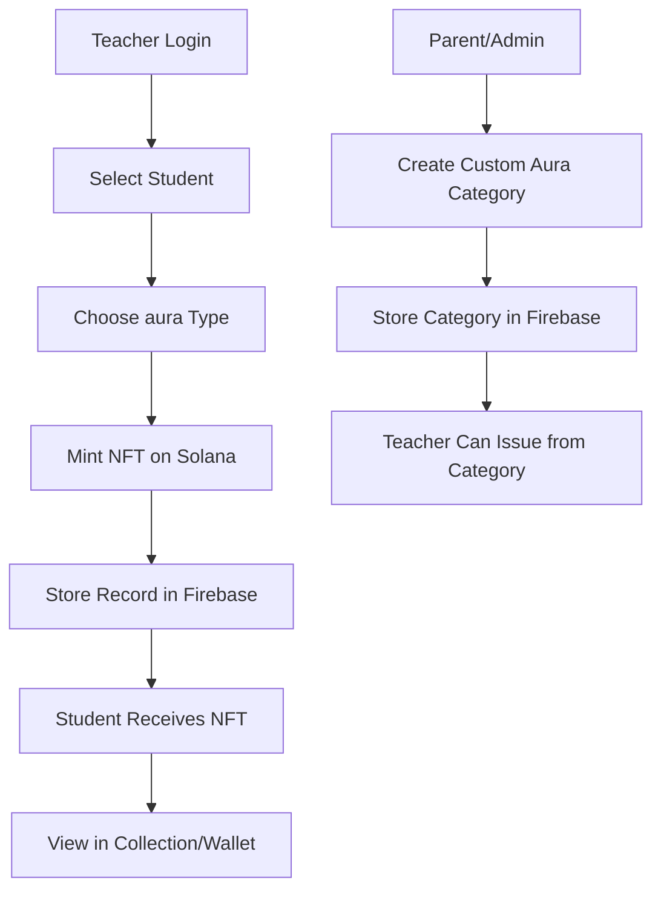
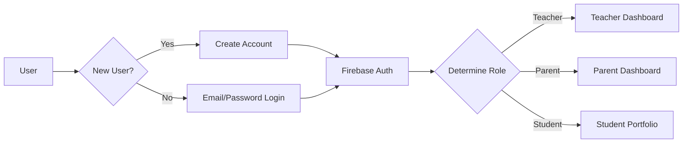
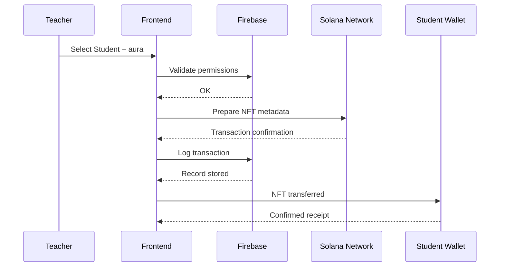

# AuraChain - Project Planning Document

  

**Project:** AuraChain  

**Hackathon Deadline:** October 30th, 2025  

**Goal:** Digital puffy stickers that teachers award, kids collect and own  

**Blockchain:** Solana  

**Frontend:** React + create-solana-app + Tailwind  

**Backend:** Firebase (Auth + Firestore)  

**Hosting:** Vercel

  

---

  

## 1. User Flows & Architecture

  

### 1.1 High-Level System Flow

  



  

### 1.2 Authentication Flow

  



  

### 1.3 Aura Minting Flow

  



  

---

  

## 2. Database Schema (Firestore)

  

### 2.1 Collections Structure

  

```

aurachain/

├── users/

│   └── {userId}

│       ├── email: string

│       ├── displayName: string

│       ├── role: "teacher" | "parent" | "student" | "admin"

│       ├── schoolId: string (reference to schools collection)

│       ├── createdAt: timestamp

│       └── walletAddress: string (optional, for students)

│

├── schools/

│   └── {schoolId}

│       ├── name: string

│       ├── location: string

│       ├── adminId: string (reference to users)

│       ├── createdAt: timestamp

│       └── isActive: boolean

│

├── students/

│   └── {studentId}

│       ├── userId: string (reference to users)

│       ├── schoolId: string

│       ├── grade: string

│       ├── enrolledAt: timestamp

│       └── walletAddress: string

│

├── teachers/

│   └── {teacherId}

│       ├── userId: string (reference to users)

│       ├── schoolId: string

│       ├── subject: string

│       ├── createdAt: timestamp

│       └── isActive: boolean

│

├── meriits/ (default aura types)

│   └── {auraId}

│       ├── name: string

│       ├── description: string

│       ├── category: "cross-class" | "math" | "art" | "pe" | "english"

│       ├── icon: string (emoji or image URL)

│       ├── color: string (hex code)

│       ├── isDefault: boolean

│       └── createdAt: timestamp

│

├── customauras/ (teacher/school created)

│   └── {customauraId}

│       ├── name: string

│       ├── description: string

│       ├── createdByTeacherId: string

│       ├── schoolId: string

│       ├── icon: string (image URL)

│       ├── color: string

│       ├── isActive: boolean

│       └── createdAt: timestamp

│

├── awardedauras/ (actual achievements)

│   └── {awardId}

│       ├── auraId: string (reference to auras or customauras)

│       ├── studentId: string

│       ├── issuedByTeacherId: string

│       ├── schoolId: string

│       ├── nftMintAddress: string (Solana NFT address)

│       ├── notes: string (optional teacher comment)

│       ├── awardedAt: timestamp

│       └── transactionHash: string

│

└── collections/ (Phase 2 - custom NFT collections)

    └── {collectionId}

        ├── name: string

        ├── createdBy: string

        ├── schoolId: string

        ├── auras: array of auraIds

        ├── collectionAddress: string (Solana)

        └── createdAt: timestamp

```

  

### 2.2 Firestore Rules (Security)

  

```

match /users/{userId} {

  allow read, write: if request.auth.uid == userId;

}

  

match /teachers/{teacherId} {

  allow read: if request.auth.uid == resource.data.userId;

  allow write: if request.auth.uid == resource.data.userId;

}

  

match /students/{studentId} {

  allow read: if request.auth.uid == resource.data.userId;

}

  

match /awardedauras/{awardId} {

  allow read: if request.auth.uid == resource.data.studentId

           || request.auth.uid == resource.data.issuedByTeacherId;

  allow create: if request.auth.uid == get(/databases/$(database)/documents/teachers/$(request.resource.data.issuedByTeacherId)).data.userId;

}

```

  

---

  

## 3. Smart Contract Outline

  

### 3.1 Solana Program Structure

  

**Use Metaplex Candy Machine v3 or custom SPL Token approach**

  

```

AuraChain Program

├── Initialize (set up program state)

├── Create aura Template (admin only)

├── Mint aura NFT (teacher authorized)

├── Transfer to Student Wallet (automatic)

└── Update Metadata (future iterations)

```

  

### 3.2 NFT Metadata Structure

  

```json

{

  "name": "Excellent Work - John Smith",

  "symbol": "aura",

  "description": "aura awarded by Mrs. Johnson on October 21, 2025",

  "image": "https://aurachain.vercel.app/badges/excellent-work.png",

  "external_url": "https://aurachain.vercel.app/aura/{awardId}",

  "attributes": [

    {

      "trait_type": "aura Type",

      "value": "Excellent Work"

    },

    {

      "trait_type": "Teacher",

      "value": "Mrs. Johnson"

    },

    {

      "trait_type": "School",

      "value": "Lincoln Elementary"

    },

    {

      "trait_type": "Date Awarded",

      "value": "2025-10-21"

    },

    {

      "trait_type": "Category",

      "value": "cross-class"

    }

  ],

  "properties": {

    "creators": [

      {

        "address": "{teacher_wallet_address}",

        "verified": true,

        "share": 0

      }

    ]

  }

}

```

  

### 3.3 On-Chain vs Off-Chain Data

  

**ON-CHAIN (Solana):**

  

- NFT mint address

- Token metadata (name, description, attributes)

- Creator verification

- Transaction history

- Mint timestamp

  

**OFF-CHAIN (Firebase):**

  

- Teacher/student relationship

- aura category templates

- Award notes/comments

- UI state (who can see what)

- Analytics/reporting

  

---

  

## 4. UI Wireframes & Component Specs

  

### 4.1 Screen 1: Authentication/Landing

  

**Purpose:** Sign up or log in, select user role

  

**Layout:**

  

```

┌─────────────────────────────────┐

│  AURACHAIN LOGO & TAGLINE      │

│  "From classroom to forever"    │

├─────────────────────────────────┤

│                                 │

│  [Sign Up] [Log In]             │

│                                 │

├─────────────────────────────────┤

│  "Choose your role:"            │

│  ○ Teacher                      │

│  ○ Parent                       │

│  ○ Student                      │

│  ○ School Admin                 │

│                                 │

│  [Continue with Selected Role]  │

└─────────────────────────────────┘

```

  

**Components:**

  

```

<AuthPage>

  <Header logo={logo} tagline="From classroom to forever" />

  <AuthToggle activeTab="signup|login" />

  <SignUpForm

    email={string}

    password={string}

    displayName={string}

    role={enum: teacher|parent|student|admin}

    schoolCode={string} (optional)

    onSubmit={handleAuth}

  />

  <SocialLogin providers={["google"]} />

  <RoleSelector

    roles={roles}

    selectedRole={role}

    onChange={setRole}

  />

</AuthPage>

```

  

---

  

### 4.2 Screen 2: Teacher Dashboard

  

**Purpose:** Teachers see students, award auras, view history

  

**Layout:**

  

```

┌──────────────────────────────────┐

│ AuraChain | Welcome, Mrs. Johnson│

│ [Logout] [Settings]              │

├──────────────────────────────────┤

│ Quick Stats                      │

│ ─────────────────────────────    │

│ auras Awarded: 24 │ This Week: 3 │

│                                  │

├──────────────────────────────────┤

│ [Award New aura]                │

│                                  │

│ Your Classes:                    │

│ ┌────────────────────────────┐   │

│ │ Class: 3rd Grade - Math    │   │

│ │ Students: 24               │   │

│ │ [View Class] [Award aura] │   │

│ └────────────────────────────┘   │

│                                  │

│ ┌────────────────────────────┐   │

│ │ Class: 3rd Grade - Science │   │

│ │ Students: 24               │   │

│ │ [View Class] [Award aura] │   │

│ └────────────────────────────┘   │

│                                  │

├──────────────────────────────────┤

│ Recent Awards                    │

│ • John Smith - Excellent Work    │

│ • Emma Davis - Teamwork          │

│ • Liam Brown - Creativity        │

└──────────────────────────────────┘

```

  

**Components:**

  

```

<TeacherDashboard>

  <NavBar user={teacher} />

  <StatsPanel

    totalAwarded={number}

    thisWeek={number}

    thisMonth={number}

  />

  <QuickActionButton

    label="Award New aura"

    onClick={openauraModal}

  />

  <ClassList

    classes={classArray}

    onViewClass={handleViewClass}

    onAwardaura={handleAwardaura}

  />

  <ClassCard

    className={string}

    studentCount={number}

    lastUpdated={timestamp}

  />

  <RecentAwardsWidget

    awards={recentAwards}

    limit={5}

  />

</TeacherDashboard>

```

  

---

  

### 4.3 Screen 3: Award aura Modal

  

**Purpose:** Teacher selects student, chooses aura type, adds notes, mints

  

**Layout:**

  

```

┌──────────────────────────────────┐

│ Award a aura          [X Close]  │

├──────────────────────────────────┤

│ Step 1: Select Student           │

│ ┌────────────────────────────┐   │

│ │ Dropdown: Choose Student   │   │

│ │ [Showing: John Smith]      │   │

│ └────────────────────────────┘   │

│                                  │

│ Step 2: Choose aura Type        │

│ ┌────────────────────────────┐   │

│ │ ⭐ Excellent Work         │   │

│ │ 🤝 Great Teamwork         │   │

│ │ 💡 Creative Thinking      │   │

│ │ 📚 Great Participation    │   │

│ │ 🏆 Improvement            │   │

│ └────────────────────────────┘   │

│                                  │

│ Step 3: Add Notes (Optional)     │

│ ┌────────────────────────────┐   │

│ │ "John did amazing work on..│   │

│ └────────────────────────────┘   │

│                                  │

│ [Cancel] [Award aura & Mint NFT]│

└──────────────────────────────────┘

```

  

**Components:**

  

```

<AwardauraModal

  isOpen={boolean}

  classId={string}

  onClose={handleClose}

>

  <StepIndicator currentStep={number} totalSteps={3} />

  <StudentSelector

    students={studentArray}

    selectedStudent={student}

    onChange={setStudent}

  />

  <auraTypeSelector

    auras={auraArray}

    selectedaura={aura}

    onChange={setaura}

    displayMode="grid|list"

  />

  <auraCard

    name={string}

    icon={emoji|url}

    color={hex}

    description={string}

    isSelected={boolean}

  />

  <NotesInput

    placeholder="Add optional notes..."

    value={notes}

    onChange={setNotes}

    maxLength={200}

  />

  <ActionButtons

    onCancel={handleClose}

    onSubmit={handleMintaura}

    isLoading={boolean}

  />

</AwardauraModal>

```

  

---

  

### 4.4 Screen 4: Student aura Portfolio/Collection

  

**Purpose:** Students view all auras they've earned, see details

  

**Layout:**

  

```

┌──────────────────────────────────┐

│ AuraChain | My Achievements     │

│ [Connected: John.sol]            │

├──────────────────────────────────┤

│ Total auras: 12                 │

│ This Month: 3                    │

├──────────────────────────────────┤

│ Your aura Collection:           │

│                                  │

│ ┌──────────┐ ┌──────────┐       │

│ │    ⭐    │ │    🤝    │       │

│ │ Excellent│ │  Teamwork│       │

│ │  Work    │ │          │       │

│ │  Mrs J.  │ │  Mr. L.  │       │

│ │ Oct 21   │ │ Oct 15   │       │

│ └──────────┘ └──────────┘       │

│                                  │

│ ┌──────────┐ ┌──────────┐       │

│ │    💡    │ │    📚    │       │

│ │ Creative │ │Great Part│       │

│ │ Thinking │ │cipation  │       │

│ │  Ms. P.  │ │  Mr. K.  │       │

│ │ Oct 10   │ │ Sep 30   │       │

│ └──────────┘ └──────────┘       │

│                                  │

│ [Load More]                      │

└──────────────────────────────────┘

```

  

**Components:**

  

```

<StudentPortfolio>

  <Header

    displayName={string}

    walletAddress={string}

    totalauras={number}

  />

  <StatsPanel

    totalauras={number}

    thisMonth={number}

    categories={object}

  />

  <auraGrid

    auras={auraArray}

    gridColumns={2|3|4}

    onauraClick={handleViewDetail}

  />

  <auraBadge

    name={string}

    icon={emoji|url}

    color={hex}

    teacher={string}

    dateAwarded={timestamp}

    onClick={handleView}

    isClickable={boolean}

  />

  <auraDetailModal

    aura={auraObject}

    nftAddress={string}

    onVerify={handleVerifyOnchain}

    onShare={handleShare}

  />

  <LoadMoreButton

    onClick={handleLoadMore}

    isLoading={boolean}

  />

</StudentPortfolio>

```

  

---

  

### 4.5 Screen 5: aura Detail View

  

**Purpose:** Show full details of a aura, verify on-chain, share

  

**Layout:**

  

```

┌──────────────────────────────────┐

│ aura Details             [Close] │

├──────────────────────────────────┤

│                                  │

│        ⭐ (Large Display)        │

│                                  │

│ Excellent Work                   │

│                                  │

│ Awarded by: Mrs. Johnson         │

│ Date: October 21, 2025           │

│ School: Lincoln Elementary       │

│                                  │

│ Notes from Teacher:              │

│ "Outstanding effort on the       │

│  mathematics assignment!"        │

│                                  │

├──────────────────────────────────┤

│ On-Chain Verification            │

│ NFT Address: 3K8s9...xQ2m       │

│ Status: ✅ Verified on Solana    │

│ Transaction: 7Vf2k... (Sep 21)   │

│                                  │

│ [View on Solana] [Share]         │

└──────────────────────────────────┘

```

  

**Components:**

  

```

<auraDetailView

  auraId={string}

  nftAddress={string}

>

  <auraDisplay

    icon={emoji|url}

    color={hex}

    name={string}

    size="large"

  />

  <auraInfo

    teacher={string}

    dateAwarded={timestamp}

    school={string}

    notes={string}

  />

  <OnChainVerification

    nftAddress={string}

    transactionHash={string}

    verified={boolean}

    network="solana"

  />

  <ActionButtons

    onViewExplorer={handleViewSolscan}

    onShare={handleShare}

    onClose={handleClose}

  />

</auraDetailView>

```

  

---

  

## 5. API Endpoints & Functions

  

### 5.1 Authentication

  

```

POST /api/auth/signup

  body: { email, password, displayName, role, schoolCode }

  returns: { userId, token, user }

  

POST /api/auth/login

  body: { email, password }

  returns: { userId, token, user }

  

POST /api/auth/logout

  returns: { success }

```

  

### 5.2 Teacher Operations

  

```

GET /api/teachers/{teacherId}/classes

  returns: { classes: ClassObject[] }

  

GET /api/teachers/{teacherId}/students/{classId}

  returns: { students: StudentObject[] }

  

POST /api/auras/award

  body: { studentId, auraId, notes, teacherId }

  returns: { awardId, nftAddress, transactionHash }

  

GET /api/teachers/{teacherId}/awards

  returns: { awards: AwardedauraObject[], pagination }

```

  

### 5.3 Student Operations

  

```

GET /api/students/{studentId}/auras

  returns: { auras: AwardedauraObject[], pagination }

  

GET /api/students/{studentId}/auras/{awardId}

  returns: { aura: AwardedauraObject, nftMetadata }

  

POST /api/students/{studentId}/wallet

  body: { walletAddress }

  returns: { success, walletAddress }

```

  

### 5.4 aura Management

  

```

GET /api/auras/default

  returns: { auras: auraObject[] }

  

GET /api/auras/custom?schoolId={schoolId}

  returns: { auras: CustomauraObject[] }

  

POST /api/auras/custom (Phase 2)

  body: { name, description, icon, color, teacherId, schoolId }

  returns: { customauraId, aura }

```

  

### 5.5 Solana Integration

  

```

POST /api/solana/mint

  body: { auraData, studentWallet, creatorWallet }

  returns: { mintAddress, signature }

  

GET /api/solana/verify/{nftAddress}

  returns: { verified, metadata, owner }

```

  

---

  

## 6. Development Roadmap

  

### Phase 1: Core MVP (Days 1-6)

  

**Days 1-2: Setup & Infrastructure**

  

- [ ] Initialize create-solana-app project

- [ ] Set up Firebase (Auth + Firestore)

- [ ] Configure Tailwind v4

- [ ] Set up deployment on Vercel

- [ ] GitHub repo with proper structure

  

**Days 3-4: Authentication & Dashboards**

  

- [ ] Firebase Auth integration (email/password)

- [ ] Teacher login flow

- [ ] Student login flow

- [ ] Basic role-based routing

- [ ] Teacher dashboard scaffold

  

**Days 5-6: aura Awarding Core**

  

- [ ] Default aura types in Firestore

- [ ] Award aura modal

- [ ] Student selector component

- [ ] aura type selector component

- [ ] NFT minting integration with Solana

- [ ] Store award records in Firebase

  

### Phase 2: Portfolio & Polish (Days 7-8)

  

**Days 7-8: Student Portfolio**

  

- [ ] Student aura collection view

- [ ] aura badge display (grid layout)

- [ ] aura detail modal

- [ ] On-chain verification display

- [ ] Solscan/Solana explorer links

- [ ] Error handling & loading states

- [ ] Responsive design refinement

  

### Phase 3: Demo & Documentation (Days 9-10)

  

**Days 9-10: Polish & Submission**

  

- [ ] Design & create aura badge assets

- [ ] Record demo video (showing complete flow)

- [ ] Write comprehensive README

- [ ] Create pitch document (vision + roadmap)

- [ ] Deploy to Vercel

- [ ] Test end-to-end flows

- [ ] Prepare hackathon submission

  

---

  

## 7. Tech Stack Details

  

### 7.1 Frontend Dependencies

  

```

Main:

- react@18

- @solana/web3.js

- @solana/wallet-adapter-react

- @solana/wallet-adapter-wallets

- @solana/wallet-adapter-react-ui

- firebase

- react-router-dom

  

UI/Styling:

- tailwindcss@4

- tailwindcss/forms

- lucide-react (icons)

  

Forms/Validation:

- react-hook-form

- zod

  

Utilities:

- axios

- date-fns

- clsx

```

  

### 7.2 Backend/Services

  

```

Firebase:

- Authentication

- Firestore Database

- Storage (for badge images)

  

Solana:

- Metaplex SDK (for NFT minting)

- @metaplex-foundation/js

- @metaplex-foundation/mpl-token-metadata

  

Deployment:

- Vercel (frontend)

- Firebase Hosting (backend if needed)

```

  

### 7.3 Development Tools

  

```

 - NextJS

- TypeScript

- ESLint

- Prettier

```

  

---

  


  

## 9. Key Implementation Notes

  

### 9.1 Solana Minting Process

  

```typescript

// Pseudocode flow

async function mintaura(studentWallet, auraData, teacherWallet) {

  1. Connect to Solana devnet/mainnet

  2. Create NFT metadata:

     - Name: `${auraName} - ${studentName}`

     - Description: Teacher + date info

     - Image URI: Point to badge design

     - Attributes: teacher, date, school, category

  3. Use Metaplex to mint NFT

  4. Transfer NFT to student wallet

  5. Return mint address & transaction hash

  6. Store in Firebase with tx hash

  7. Return to UI for confirmation

}

```

  

### 9.2 Firebase Security Rules Considerations

  

- Teachers can only award auras for their students

- Students can only view their own auras

- Parents can only view their children's auras

- Admins have elevated permissions

- All transactions logged for audit trail

  

### 9.3 Error Handling

  

Critical error scenarios to handle:

  

- Wallet not connected when trying to mint

- Insufficient SOL for transaction

- Student wallet invalid/unreachable

- Firestore write failure

- Network congestion on Solana

- User permission denied scenarios

  

### 9.4 Testing Strategy

  

**Phase 1 Testing:**

  

- Use Solana devnet for all development

- Mock Firebase data for UI testing

- Test teacher award flow manually

  

**Phase 2 Testing:**

  

- End-to-end testing on devnet

- Student portfolio display

- Integration between Firebase + Solana

  

**Phase 3:**

  

- Manual QA of entire flow

- Test on testnet before mainnet

- Prepare demo scenario

  

---

  

## 10. Post-Hackathon Roadmap (Phase 2)

  

### 10.1 Custom aura Categories

  

- Allow teachers to create custom aura types

- Upload custom icons/designs

- Assign to specific classes or school-wide

  

### 10.2 Metrics & Analytics

  

- Dashboard showing aura distribution

- Teacher insights on student performance

- Trend analysis

  

### 10.3 Parent Portal

  

- Parents view children's auras

- Receive notifications of new awards

- Share achievements

  

### 10.4 School Admin Features

  

- Manage teachers and students

- Set school branding

- View school-wide statistics

  

### 10.5 Marketplace/Sharing

  

- Share aura collections publicly

- Potential monetization (premium auras)

- Cross-school aura verification

  

### 10.6 Mobile App

  

- React Native version

- Offline support

- Push notifications

  

---

  

## 11. Submission Checklist

  

**For October 30 Deadline:**

  

- [ ] GitHub repo with clean README

- [ ] Live demo on Vercel (testnet)

- [ ] 2-3 minute demo video showing:

    - Teacher login & award aura flow

    - NFT minting on Solana

    - Student portfolio view

    - aura detail & verification

- [ ] Pitch document (vision, problem, solution, roadmap)

- [ ] Figma/design mockups (optional but impressive)

- [ ] Code is commented and clean

- [ ] All environment variables documented

- [ ] Testnet addresses & addresses documented

  

---

  

## 12. Success Metrics

  

**For Hackathon:**

  

- ✅ Working end-to-end flow (teacher → mint → student)

- ✅ NFTs actually minting on Solana

- ✅ Clean, intuitive UI

- ✅ Clear problem statement & vision

- ✅ Judges can test it live

  

**For Post-Launch:**

  

- Teachers actively using platform

- Students collecting auras

- Growing NFT adoption

- Clear path to monetization/scale